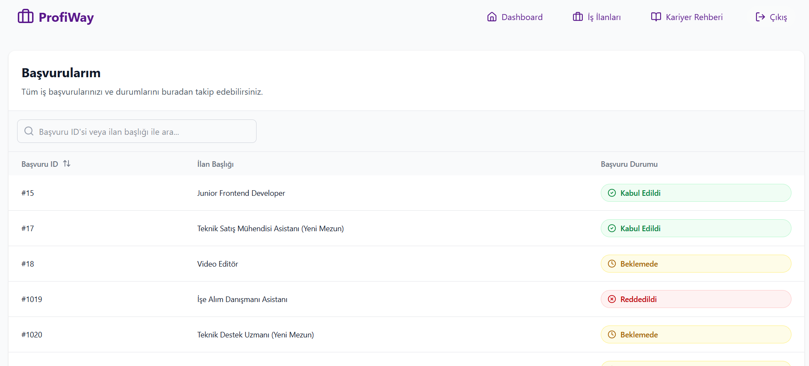
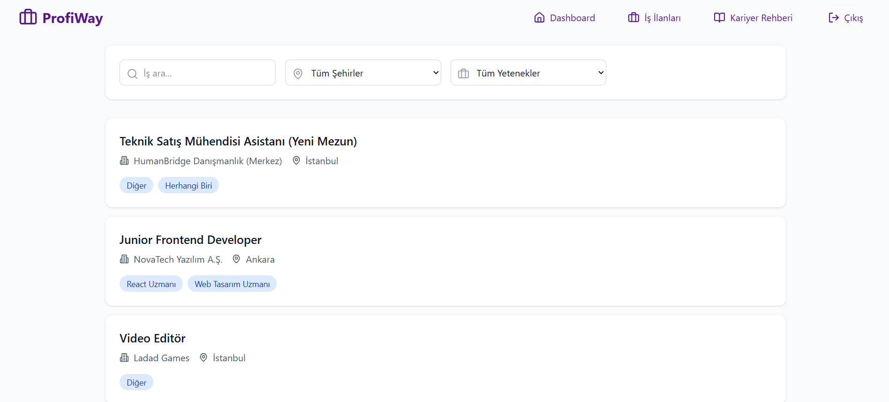
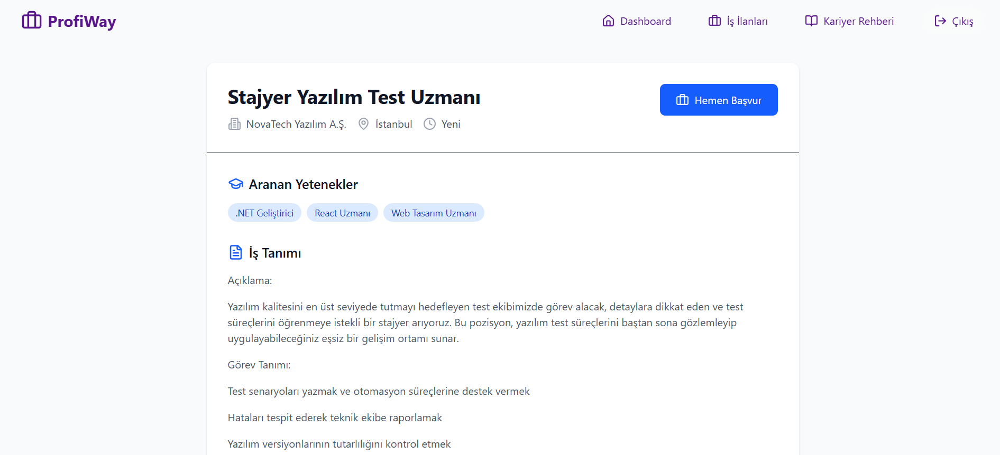
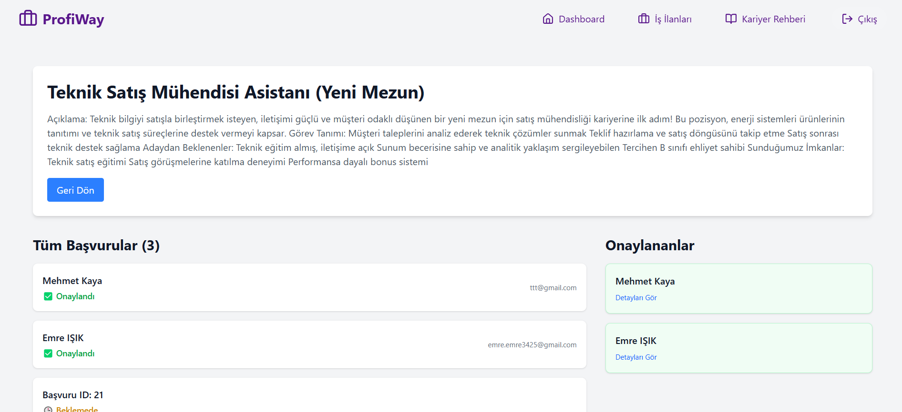
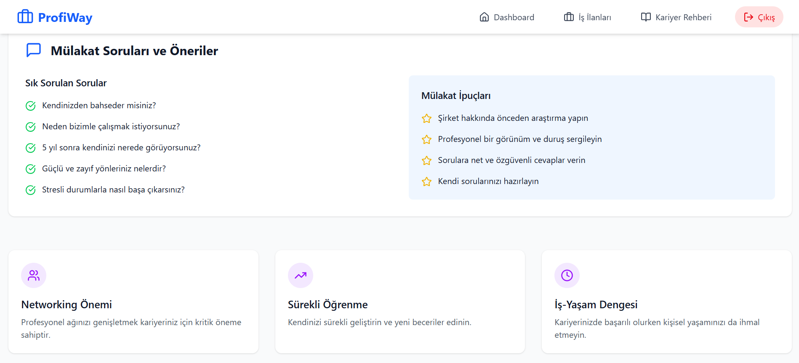

# ProfiWay

**ProfiWay** is a modern job posting and application platform designed to connect employers and new graduate job seekers in a seamless and efficient way. This project aims to help new graduates find job opportunities and allow companies to find suitable candidates based on competencies and resumes.

---

## 🌟 Features

- 🔐 **User Authentication & Authorization**  
  Secure login system using JWT. Role-based access control (Job Seeker, Company Representative, Admin).

- 📄 **Job Postings**  
  Companies can create, update, and manage job listings.

- 👨‍💼 **Job Applications**  
  Job seekers can view detailed job ads and apply with their CV.

- 🎯 **Competency Matching System**  
  Jobs and users are linked through a shared competence system to enable more meaningful matches.

- 📍 **City & Company Selection**  
  Location-based filtering and company linking for job listings.

- 📱 **Responsive Frontend**  
  Fully responsive interface using Tailwind CSS and React.

---

## 🔧 Technologies Used

### Backend - [.NET Core API]

- **.NET 8**
- **ASP.NET Core Web API**
- **Entity Framework Core**
- **SQL Server**
- **AutoMapper**
- **JWT Authentication**
- **Fluent Valiation**
- **Mediatr**
- **Redis**
- **LinqKit**
- **Onion Architecture**
- **CQRS Pattern**

### Frontend - [React.js]

- **React 18**
- **React Router**
- **Axios**
- **Tailwind CSS**
- **Lucide Icons**

---

## 🎯 Future Plans

- Email notifications for applications

- Admin dashboard with analytics

- AI-based resume builder tool for job seekers

- AI-based job recommendations

## 📸 Screenshots

### 🏠 Home Page  

### 👨‍💼 JobSeeker Applications

### 📝 Jobs 

### 📝 Job Detail Page 

### 👨‍💼 Job Applications Page

### 📝 Career Guide Page

---

Feel free to ⭐ the repo if you find it useful!

